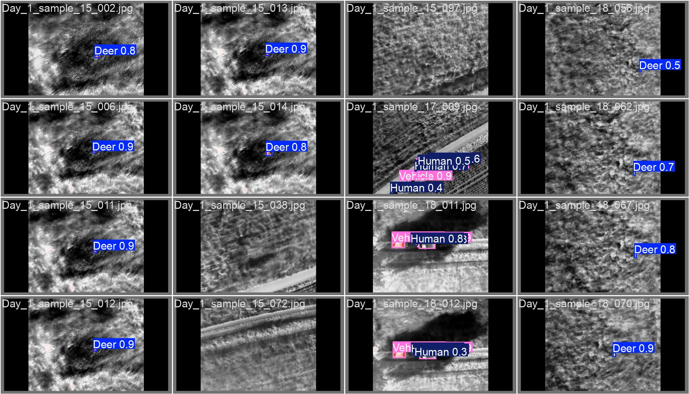
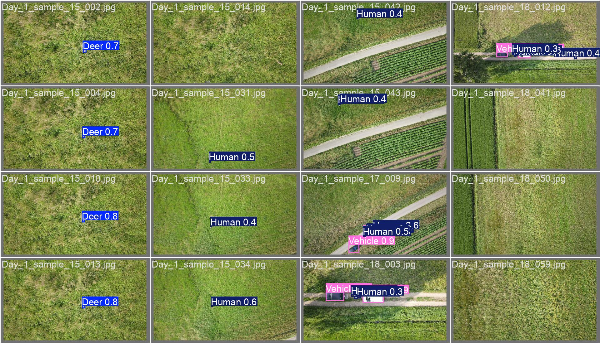
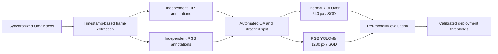

# Multimodal UAV Wildlife Detection with YOLOv8

An end-to-end computer-vision pipeline that turns synchronized UAV thermal-infrared (TIR) and RGB video into independently validated wildlife detectors.

## Start here — the complete multimedia report

### **[Open the complete multimedia report →](https://bodhi584.github.io/multimodal-uav-wildlife-detection-yolov8/)**

This is the primary project experience and the recommended first review. It presents the complete data-engineering, annotation, modeling, and evaluation story through RGB/Thermal comparisons, experiment evidence, and embedded inference videos.

> **Recommended path:** Explore the report and saved experiment evidence first. To reuse the training workflow, open the notebook and supply your own YOLO-format data. The original training dataset is not distributed with this repository.

Explore the training configuration:

**[Open the training notebook in Google Colab (bring your own data)](https://colab.research.google.com/github/bodhi584/multimodal-uav-wildlife-detection-yolov8/blob/main/notebooks/training_reproducibility.ipynb)** · [Review the engineering notes](docs/technical_notes.md) · [View the report source](docs/index.html)

<p align="center">
  
  
</p>

## At a glance

| | |
| --- | --- |
| **Problem** | Small aerial targets, sensor-specific appearance, timing offsets, and flight-dependent parallax |
| **Approach** | Timestamp synchronization, independent per-sensor annotation, automated QA, and two tuned YOLOv8n detectors |
| **Validation** | 80/20 stratified split with 15% negative frames; separate confidence calibration for each modality |
| **Best result** | **85.93% RGB mAP@50** and **84.70% Thermal mAP@50** |
| **Stack** | Python, PyTorch, Ultralytics YOLOv8, OpenCV, FFmpeg, X-AnyLabeling, Google Colab |

## Results

| Model | Final configuration | Validation mAP@50 | mAP@50-95 | Best F1 | Confidence at best F1 |
| --- | --- | ---: | ---: | ---: | ---: |
| Thermal (TIR) | YOLOv8n, 640 px, SGD | **84.70%** | 53.26% | 0.78 | 0.563 |
| RGB (visible) | YOLOv8n, 1280 px, SGD | **85.93%** | 46.74% | 0.82 | 0.350 |

On an unseen winter-grassland sequence, the native Thermal model produced **555 detections** against **572 human annotations** across **109 frames**, equal to **97.03% human-count coverage**.

That number is intentionally reported as a **sequence-level coverage proxy**, not object-level recall: detections were not matched one-to-one with ground-truth boxes. Recalculate it with:

```bash
python src/metrics.py --detections 555 --annotations 572
```

The F1-confidence evidence is available for the [Thermal model](assets/thermal_f1_curve.png) and [RGB model](assets/rgb_f1_curve.png).

## What I built

- Designed a Thermal-first dual-stream annotation methodology with modality-specific boxes and RGB semantic verification.
- Synchronized UAV videos by timestamp with FFmpeg while preserving each sensor's native geometry.
- Defined annotation rules for thermal halo, residual heat, shadows, truncation, and occlusion.
- Built pre-training QA for YOLO labels, class IDs, normalized coordinates, paired frames, split integrity, and negative-frame balance.
- Ran resolution and optimizer experiments, then selected a different operating configuration for each sensor.
- Calibrated per-modality confidence thresholds from F1 curves and separated standard validation metrics from the OOD count proxy.
- Packaged a Colab workflow, reusable training utilities, and evidence-led technical documentation.

## Engineering approach

Thermal and RGB cameras do not share one stable pixel coordinate system during flight. Their resolutions, fields of view, capture timing, and parallax differ. A fixed homography was tested but did not remain reliable as altitude and viewpoint changed, so the final design keeps annotation and model optimization independent by modality.



Three decisions mattered most:

| Decision | Evidence-based reason |
| --- | --- |
| Separate models per modality | Thermal and RGB have different statistics, native resolutions, and best observed configurations |
| 15% negative images | Background-only frames reduce false alarms without dominating a limited training set |
| Per-model F1 thresholds | One generic confidence threshold would ignore the models' different precision-recall behavior |

The full resolution and optimizer comparisons are documented in [technical notes](docs/technical_notes.md).

## Limitations

- The in-distribution numbers are validation metrics; the limited custom dataset did not support a separate hold-out test set.
- The 97.03% OOD count ratio does not identify false positives or false negatives at object level.
- Transfer was strong on unseen open winter grassland but weaker in dense summer canopy, where branches fragmented thermal signatures.
- The original training and validation data are not distributed here. Recomputing the reported metrics requires the corresponding annotations, evaluation split, trained weights, and evaluation settings; training on your own data will produce different results.

The next rigorous step is one-to-one OOD box matching, followed by canopy-rich training data and uncertainty-aware temporal or cross-modal fusion.

## Repository map

```text
assets/      Selected final-run predictions and F1 curves
docs/        Complete multimedia HTML report and technical notes
notebooks/   Colab-ready training workflow
src/         Training, dataset validation, and metric utilities
tests/       Lightweight tests for public metric logic
```

## Use the workflow with your own data

The [Colab training notebook](https://colab.research.google.com/github/bodhi584/multimodal-uav-wildlife-detection-yolov8/blob/main/notebooks/training_reproducibility.ipynb) documents the final training settings. It requires your own prepared YOLO-format dataset and does not automatically download the original data.

1. Prepare data that you are authorized to use, with separate training and validation splits. The example class order is Human, Vehicle, Deer, Hare, Dog, Duck; adapt the YAML and notebook class names if your classes differ.
2. In Colab, select a GPU runtime, then upload/extract your dataset or mount Google Drive and configure the dataset paths.
3. Check that each `data.yaml` points to the actual image directories before starting training.

For the default two-stream example, use this layout:

```text
datasets/
  YOLO_Thermal/{data.yaml,images/{train,val},labels/{train,val}}
  YOLO_RGB/{data.yaml,images/{train,val},labels/{train,val}}
```

For local execution:

```bash
python -m venv .venv
source .venv/bin/activate
pip install -r requirements.txt

python src/validate_dataset.py --dataset datasets/YOLO_Thermal
python src/train.py --data datasets/YOLO_Thermal/data.yaml --modality thermal
python src/train.py --data datasets/YOLO_RGB/data.yaml --modality rgb
python -m unittest discover -s tests -v
```

The training defaults match the reported final configurations: 100 epochs, batch size 16, SGD, patience 20, Thermal at 640 px, and RGB at 1280 px.

### Use trained weights for inference

The repository currently contains prediction examples, F1 curves, and reported metrics; downloadable project-trained weights are not yet included. These saved outputs let readers inspect the experiment evidence. Running the trained detectors requires the actual model weights.

Once you have a project-trained checkpoint, run it on images or video that you are authorized to use:

```bash
yolo predict model=/path/to/thermal_best.pt source=/path/to/your/images imgsz=640 conf=0.563
```

Replace the placeholder paths with your checkpoint and input. Use `imgsz=1280 conf=0.350` for the reported RGB operating configuration. Inference on new inputs demonstrates the model’s behavior; recomputing the reported mAP requires the original evaluation split and labels.

## Skills demonstrated

Computer vision · multimodal data engineering · object detection · experiment design · annotation-system design · data quality assurance · model evaluation · technical communication · reproducible ML

## Data, attribution, and license

The source imagery is from Praschl et al., **BAMBI Dataset: Multimodal Nadir UAV-Recordings of Forest Wildlife**, DOI [10.5281/zenodo.18692354](https://doi.org/10.5281/zenodo.18692354), licensed under [CC BY 4.0](https://creativecommons.org/licenses/by/4.0/). The displayed prediction examples are derived from that dataset and retain the same attribution requirement.

The source imagery belongs to its original rights holders. This repository does not redistribute the source videos or the prepared training/validation dataset; obtain any source data independently under its applicable terms. Project-trained weights are not currently distributed here. Original code in this repository is released under the [MIT License](LICENSE). Ultralytics software and models remain subject to their own licensing terms.
